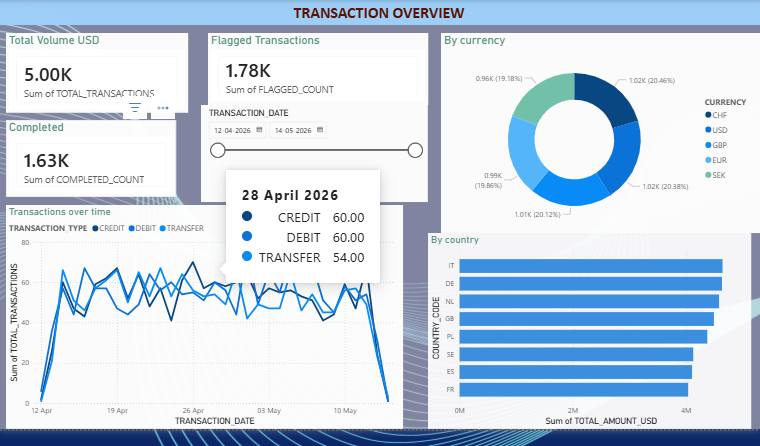
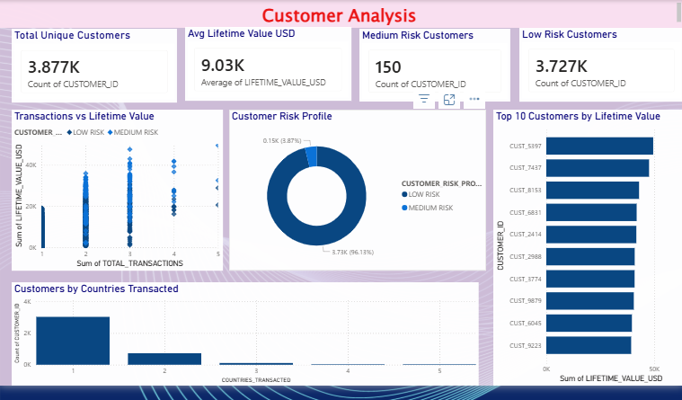
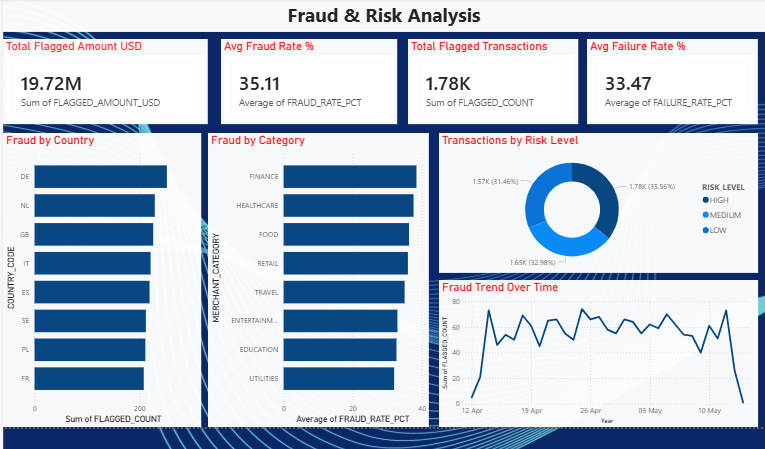

# 🏦 Real-Time Financial Transaction Analytics Platform


## 📌 Project Overview

An end-to-end **real-time financial data engineering pipeline** built on Snowflake and AWS, processing 5,000+ financial transactions through a full **Medallion Architecture** (Bronze → Silver → Gold) with automated orchestration, data quality testing, and live Power BI dashboards.

---

## 🏗️ Architecture
Python Generator → AWS S3 → Snowpipe → Bronze Layer
↓
Streams & Tasks (CDC)
↓
Silver Layer
↓
dbt Models
↓
Gold Layer
↓
Apache Airflow (Orchestration)
↓
Power BI Dashboard

---

## 🛠️ Tech Stack

| Layer | Technology |
|-------|-----------|
| Cloud Storage | AWS S3 |
| Data Warehouse | Snowflake |
| Ingestion | Snowpipe + SQS Event Notifications |
| CDC Pipeline | Snowflake Streams & Tasks |
| Transformation | dbt (Medallion Architecture) |
| Orchestration | Apache Airflow (Astro) |
| Visualization | Power BI (DirectQuery) |
| Language | Python 3.12 |
| CI/CD | GitHub Actions |
| Security | RBAC, Dynamic Data Masking |

---

## 📂 Project Structure
snowflake-financial-pipeline/
├── data_generator/
│   └── generate_transactions.py    # Simulates financial transactions
├── snowflake/
│   ├── 01_setup.sql               # Database, schemas, warehouse
│   ├── 02_snowpipe.sql            # Snowpipe + S3 integration
│   └── 03_streams_tasks.sql       # CDC pipeline
├── dbt_financial/
│   ├── models/
│   │   ├── staging/               # Silver layer views
│   │   └── gold/                  # Gold layer tables
│   └── dbt_project.yml
├── airflow/
│   └── dags/
│       └── financial_pipeline_dag.py
├── powerbi/
│   └── financial_dashboard.pbix
└── README.md
---

## 🔄 Pipeline Stages

### Stage 1 — Data Generation
- Python script generates **500 realistic financial transactions** per batch
- Covers 8 EU countries, 5 currencies, 8 merchant categories
- Auto-uploads CSV files to **AWS S3** (`raw/transactions/`)

### Stage 2 — Auto Ingestion (Snowpipe)
- **S3 Event Notification → SQS → Snowpipe**
- Files auto-ingested into **Bronze layer** within seconds
- No manual COPY INTO needed

### Stage 3 — CDC Pipeline (Streams & Tasks)
- **Snowflake Stream** detects every new Bronze record
- **Task** runs every 5 minutes automatically
- Cleans, enriches, and loads into **Silver layer**
- Enrichments: currency conversion to USD, risk scoring, time features

### Stage 4 — dbt Transformations (Gold Layer)
- `stg_transactions` → staging view on Silver
- `fct_transactions_daily` → daily aggregations (4,873 rows)
- `fct_customer_summary` → customer metrics (3,877 rows)
- `fct_fraud_analysis` → fraud patterns (4,605 rows)
- **13 data quality tests** — all passing ✅

### Stage 5 — Orchestration (Airflow)
- DAG: `financial_pipeline` runs **every 6 hours**
- Tasks: Generate → Wait → dbt Run → dbt Test
- Built with **Astronomer Astro CLI**

### Stage 6 — Visualization (Power BI)
- **Live DirectQuery** connection to Snowflake Gold layer
- **Page 1:** Transaction Overview
- **Page 2:** Customer Analysis
- **Page 3:** Fraud & Risk Analysis

---

## 🔐 Security Implementation

- **RBAC** — 4-role hierarchy (PIPELINE_ADMIN, DATA_ENGINEER, DATA_ANALYST, COMPLIANCE_OFFICER)
- **Dynamic Data Masking** — sensitive fields masked by role
- **AWS IAM** — least-privilege S3 access via trust policy
- **Snowflake Storage Integration** — secure S3 connection without hardcoded keys

---

## 📊 Dashboard Screenshots

### Transaction Overview


### Customer Analysis


### Fraud & Risk Analysis


---

## 🚀 How to Run

### Prerequisites
- Snowflake account (AWS region)
- AWS account with S3 access
- Python 3.8+
- dbt-snowflake
- Docker Desktop
- Astronomer Astro CLI

### Setup Steps

```bash
# 1. Clone the repo
git clone https://github.com/Sajid637/snowflake-financial-pipeline.git
cd snowflake-financial-pipeline

# 2. Install Python dependencies
pip install boto3 pandas faker snowflake-connector-python python-dotenv

# 3. Configure environment
cp .env.example .env
# Fill in your AWS and Snowflake credentials

# 4. Run Snowflake setup
# Execute SQL files in snowflake/ folder in order

# 5. Generate and upload data
cd data_generator
python generate_transactions.py

# 6. Run dbt models
cd ../dbt_financial
dbt run
dbt test

# 7. Start Airflow
cd ../airflow
astro dev start
```

---

## 📈 Key Metrics

| Metric | Value |
|--------|-------|
| Total Records Processed | 5,000+ |
| dbt Models | 4 (1 staging + 3 gold) |
| dbt Tests Passing | 13/13 ✅ |
| Airflow Tasks | 4 |
| Pipeline Schedule | Every 6 hours |
| Power BI Pages | 3 |
| AWS S3 Files | 10 CSV files |
| Snowflake Schemas | 4 (BRONZE, SILVER, GOLD, AUDIT) |

---

## 👤 Author

**Mohammad Sajid Abbas**
- 📧 sajidabbas637@gmail.com
- 💼 Data Engineer | Snowflake | AWS | dbt | Airflow
- 🔗 [LinkedIn](https://https://www.linkedin.com/in/sajid-abbas-a7b817180/)
- 🌐 [Project 1: E-Commerce Analytics](https://github.com/Sajid637/snowflake-ecommerce-analytics)